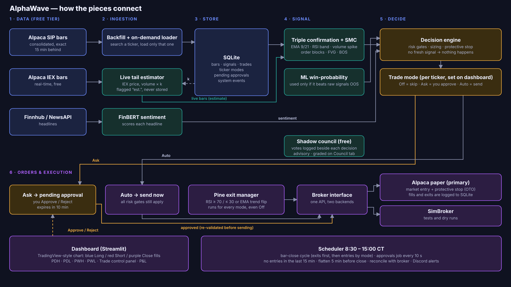
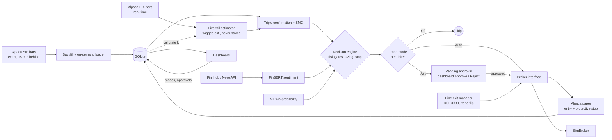

# AlphaWave architecture

*(Source: `assets/diagrams/build_diagram.py` → `architecture.svg` / `.png`. The same flow as a GitHub-rendered diagram is below.)*

## Flow of one bar

1. **Scheduler** fires at each bar close (8:30–15:00 CT). Bars: exact SIP history from the store + the newest minutes estimated from real-time IEX (`LIVE_HYBRID`), so decisions are made on the just-closed candle, not one 16 minutes old.
2. **Exits first.** Any open position is closed when the Pine rule fires (`RSI ≥ 70` for longs / `RSI ≤ 30` for shorts, or the EMA 9/21 trend flips). This runs for every mode, including Off.
3. **Entries by mode.** A qualifying fresh signal passes the decision engine (kill switch, signal age, daily loss, position limits, ML gate, sentiment, stop sanity, sizing), then:
   - **Off** – skipped. **Auto** – sent to Alpaca now. **Ask** – saved as a pending approval and announced on Discord.
4. **Approvals** – the dashboard writes your Approve / Reject; the scheduler's 10-second job re-validates (window, position limits, daily loss, price vs. stop) and only then sends the order.
5. **Protection** – each entry carries a broker-side protective stop (OTO). Positions are flattened 5 minutes before the close; no new entries in the last 15 minutes.

## Shadow council

A free, rule-based panel of analysts votes on every fresh signal and is logged next to the real decision (`council_votes`). It is advisory only; the Council tab grades it against outcomes so it can be promoted into the decision engine after the paper run if it proves useful. An LLM-based debate is parked for later (cost).

## Data honesty

* SIP is exact but arrives ~15 minutes late on the free plan; IEX is real-time but covers only IEX's share of volume. The live tail uses IEX prices and rescales IEX volume by `k = median(SIP volume / IEX volume)` measured on overlapping bars. It is an **estimate**, shown faded in the chart (`live est.`), never written to the database, and replaced by the exact SIP bar later. Calibration quality (price error, volume-spike agreement) is logged to `system_events`.
* For exact real-time data, Alpaca's paid plan with `SIP_DELAY_MINUTES=0` and `LIVE_HYBRID=false`.
